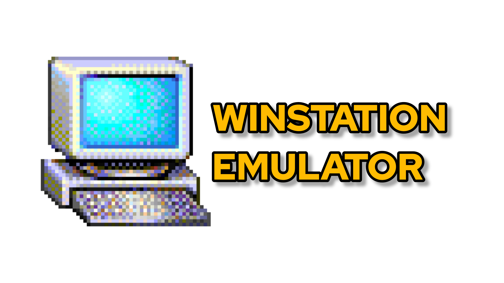

# WinStation Emulator
WinStation Emulator brings the experience of running Windows on Android devices. Based on the iBochs PC Emulator, it includes multiple improvements, such as enhanced performance, updated system support, and modernized user interface elements.

